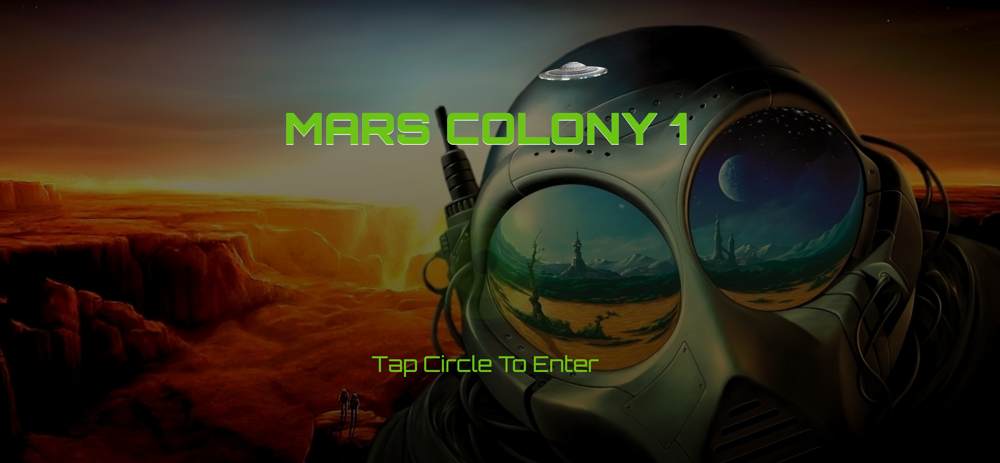
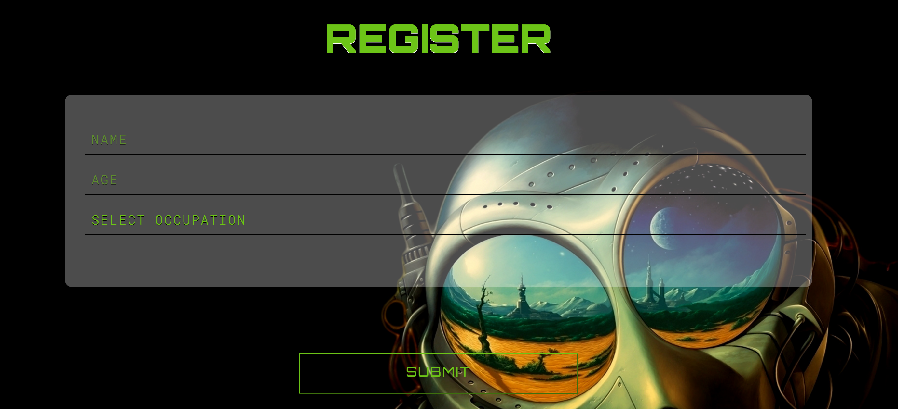
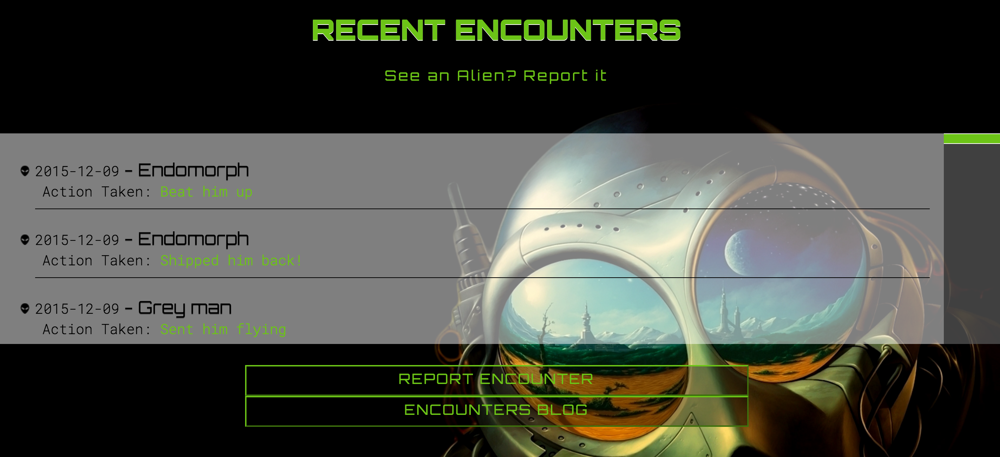

## Angular 2 Project - Mars Colony App

This was an Angular2 Project using MVC concept with 4 different views. The concept is a web-based application for Earth colonists exploring Mars. The user can view and post recent ecounters that they have experienced.  We used a JSON endpoint to implement GET and POST HTTP requests using Angular’s HTTP service.  The app will save new Colonist's information, save new Alien encounters, fetch a list of recent Alien encounters, and create a new encounters report. 

## Reflections

- Better understanding of REST application architecture
- Better understanding of Promise-based HTTP Requests using Angular’s HTTP module
- Use Router Directives in Component Views to navigate to routes defined in your application

This project helped me understand the file structure and how the different components interact with each other. This project was a small introduction to this powerfull Javascript framework that allows you to build dynamic web applications.  I would like to further my skills and build out more Angular2 projects in the future. 

## Technologies used

- Angular2
- Typescript
- npm
- html5
- SASS

## Screen Shots
####Landing Page

####Arrival Page

####Encounters Page

